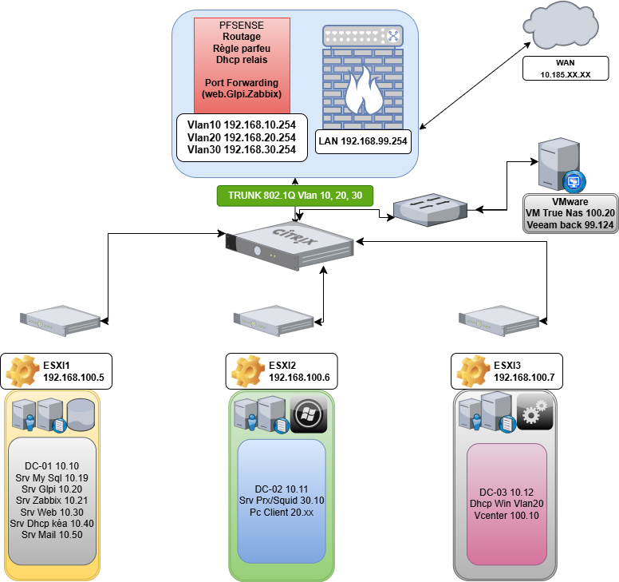

# SOC Homelab - Wazuh

## Présentation

Ce projet présente la mise en place d’un laboratoire SOC (Security Operations Center) personnel.

L’objectif est de construire une infrastructure complète avec plusieurs serveurs et de surveiller les événements de sécurité avec le SIEM Wazuh.

---

## Infrastructure du laboratoire

Le lab est hébergé sur VMware ESXi et contient les machines suivantes :

- DC01 – Windows Server 2022 – Domain Controller
- DC02 – Windows Server 2022 – Domain Controller
- MYSQL – Ubuntu 22.04 – Serveur base de données
- MAIL – Ubuntu 22.04 – Serveur mail
- ZABBIX – Ubuntu 22.04 – Serveur monitoring
- GLPI – Ubuntu 22.04 – Gestion de parc informatique
- DHCP – Ubuntu 22.04 – Serveur DHCP
- WAZUH – Ubuntu 22.04 – SIEM Manager

---

## Technologies utilisées

- VMware ESXi
- Windows Server 2022
- Ubuntu Server 22.04
- Active Directory
- Wazuh SIEM
- OpenSearch Dashboard

---

## Simulation d’attaques

Dans ce laboratoire plusieurs attaques ont été simulées :

- SSH brute force
- Tentatives de connexion avec utilisateur inexistant
- Élévation de privilèges avec sudo

Ces attaques sont détectées par Wazuh et visibles dans le dashboard.

---

## Objectifs du projet

- Construire une infrastructure d’entreprise
- Déployer un SIEM
- Surveiller les logs
- Détecter des attaques
- Pratiquer l’analyse SOC

## Architecture du laboratoire

