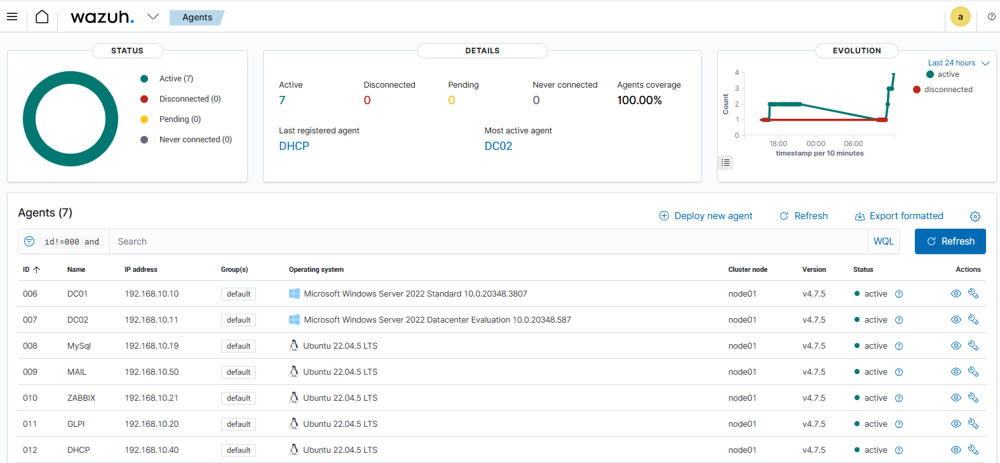

# SOC Homelab - Wazuh

## Présentation

Ce projet présente la mise en place d’un laboratoire SOC (Security Operations Center) personnel.

L’objectif est de simuler un environnement d’entreprise afin de surveiller les événements de sécurité, détecter des attaques et analyser les incidents à l’aide du SIEM Wazuh.

---

## Infrastructure du laboratoire

Le lab est hébergé sur VMware ESXi et contient les machines suivantes :

- DC01 – Windows Server 2022 – Domain Controller
- DC02 – Windows Server 2022 – Domain Controller
- MYSQL – Ubuntu 22.04 – Serveur base de données
- MAIL – Ubuntu 22.04 – Serveur mail
- ZABBIX – Ubuntu 22.04 – Serveur monitoring
- GLPI – Ubuntu 22.04 – Gestion de parc informatique
- DHCP – Ubuntu 22.04 – Serveur DHCP
- WAZUH – Ubuntu 22.04 – SIEM Manager

---

## Architecture du laboratoire

---

## Wazuh Dashboard

---

## Simulation d’attaque – SSH Brute Force

### Scénario

Une attaque de type brute force a été simulée contre un serveur Linux via SSH.

L’objectif était de tester la capacité du SIEM Wazuh à détecter des tentatives de connexion répétées.

---

### Détection

Wazuh a généré plusieurs alertes indiquant :

- des tentatives de connexion échouées
- des utilisateurs invalides
- une activité anormale sur le service SSH

---

### MITRE ATT&CK

- T1110 – Brute Force

---

### Preuve

---

### Analyse SOC

En analysant les logs, on observe :

- une répétition rapide des tentatives de connexion
- plusieurs identifiants incorrects
- une activité concentrée sur un court intervalle de temps

Ce comportement est typique d’une attaque brute force visant à compromettre un compte utilisateur.

---

### Impact potentiel

- compromission d’un compte
- accès non autorisé au système
- élévation de privilèges possible

---

### Conclusion

Le SIEM Wazuh permet :

- la détection en temps réel
- la corrélation des événements
- l’analyse des comportements suspects

Cette simulation valide l’efficacité du SOC homelab.

- Investigation SOC
